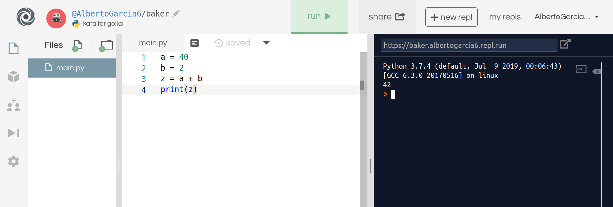
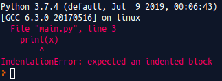

# Manual de la prueba de acceso para el Bootcamp de Data Analytics de Ironhack

## Propósito de este documento

Con este documento pretendemos darte una ayuda para que pases la prueba técnica de acceso al bootcamp de Ironhack en análisis de datos y sepas a lo que te vas a enfrentar. Consistirá principalmente en resolver un problema básico de programación en Python. Los conceptos estadísticos necesarios serán mínimos.

Contiene tres secciones: 
* **Programación online**: para que practiques fácilmente tus códigos. 
* **Conocimientos de Python**: para mostrarte los conocimientos mínimos con ejemplos. 
* **Ejemplo de prueba de acceso**: para que lo resuelvas y nos envíes tu solución. 

## Programación online

Para programar sin tener que instalarte ningún software hazte una cuenta en **repl**. Podrás practicar todo lo que quieras en Python y en muchos otros lenguajes de programación. Intenta probar todo lo que se muestra en este documento, incluido el ejemplo de prueba de acceso. 

https://repl.it/repls

Sólo debes poner código en la sección blanca y darle al botón verde <span style="color:green">**RUN**</span>.

 

## Conocimientos de Python

Durante la prueba te pediremos que apliques algunos de los conceptos de esta sección. Los imprescidibles son: listas, bucles y condicionales. 

### Salida
Para mostrar por pantalla un mensaje. 
```python
print("Hello World")
```

### Variables
Para asignar valores a variables. 
```python
# cadena de caracteres
mensaje = "Hello World"
print(mensaje)

# número entero
a = 40
b = 2
z = a + b
print(z)
```

### Haciendo cálculos
Python es una calculadora supervitaminada. 
```python
# cálculos
suma = 39 + 3
resta = 15 - 13
multiplicacion = 12 * 2
division = 7 / 3
division_entera = 7 // 3
modulo = 7 % 3

# outputs
print(suma)
print(resta)
print(multiplicacion)
print(division)
print(division_entera)
print(modulo)
```

### Entrada
Para escribir con el teclado y que la máquina lo almacene. Luego podremos usarlo y mostrarlo por pantalla si queremos. 
```python
nombre = input("Escribe tu nombre: ")
print("Hola", nombre, "!")
```

### Tipos de datos
Para ver el tipo de variable que estamos usando: entero, número con decimales, cadena de caracteres, lista, etc. 
```python
# cadena de caracteres
cadena = "Esto es una cadena de caracteres"
tipo_cadena = type(cadena)
print(tipo_cadena)

# número entero
entero = 42
tipo_entero = type(entero)
print(tipo_entero)

# número con decimales
flotante = 42.42
tipo_flotante = type(flotante)
print(tipo_flotante)

# lista
lista = [1,2,3,4,5,1,2,3,4,5]
tipo_lista = type(lista)
print(tipo_lista)
```

### Contar e indexar
Para ver la longitud de algo que se pueda recorrer: lista, cadena de caracteres, tupla, diccionario, etc.
Para seleccionar un elemento por su índice
```python
hechizo = "expeliarmus"

print(len(hechizo))
print(hechizo[0])
print(hechizo[1])
print(hechizo[-1])
```

### Listas
La salsa de python. Las listas no tienen límite. 
```python
# Ejemplos de listas. 
numeros = [3,4,3,5,7,4,3,1,1]
ninjas = ['Naruto', 'Sakura', 'Sasuke', 'Hinata', 'Shikamaru']
mezcla = ['apple', 390, 876, 'orange', 'highway', 0.42, 87]

# Esto es una lista de listas que asignamos a la variable de nombre matriz
matriz = [[3,4,5], [1,2,3], [7,3,2]]

# Para seleccionar un elemento por su índice
print(ninjas[0])
print(ninjas[-1])
print(matriz[0])

# lista[start: stop: step]
print(ninjas[::2])
print(ninjas[1: 4])
print(ninjas[::-1])

# añadir un elemento nuevo al final de un lista
print(ninjas)
ninjas.append('Kakashi')
print(ninjas)

# sumar listas
estudiantes = ['Harry', 'Hermione', 'Ron']
profesores = ['Dumbledore', 'Severus', 'Hagrid']
print(estudiantes)
print(profesores)
hogwards = estudiantes + profesores
print(hogwards)

# media de un conjunto de números
numeros = [34, 12, 93, 783, 330, 896, 1, 55]
suma = sum(numeros)
longitud = len(numeros)
media = suma / longitud
print(media)

# mínimo y máximo
minimo = min(numeros)
maximo = max(numeros)
print(minimo)
print(maximo)

# Ordenación
numeros_ordenados = sorted(numeros)
print(numeros_ordenados)
```

### Conjuntos
Los conjuntos son agrupaciones de elementos pero no se almacenan repetidos. 
```python
# lista con valores repetidos
lista_peliculas_cine = ['Alien', 'Terminator 2', 'Arma Letal', 'Alien', 'Terminator 2']

# conjunto con los valores de la lista sin repetir
opciones_peliculas = set(lista_peliculas_cine)

print(lista_peliculas_cine)
print(opciones_peliculas)
```

### Diccionarios
Para obtener un dato a partir de otro. La película **Alien** tiene una valoración de **9.5**. 
```python
# diccionario de película y valoración dada
valoraciones = {'Alien':9.5, 'Terminator 2':8.9, 'Arma Letal':7.3}

# algunos métodos de diccionarios
print(valoraciones['Alien'])
print(valoraciones.keys())
print(valoraciones.values())
print(valoraciones.items())
```

### Tipos booleanos (True, False)
_Ser o no ser._ `True o False`
```python
print(5 + 5 == 10)
print('isla' != 'pantano')
print(100 >= 75)
print(93 <= 80)

# para ver si un elemento se encuentra en un conjunto o lista usaremos in
print(3 in [1,2,3,4,5])
print(3 not in [1,2,3,4,5])

print((5 + 5 == 10) and ('isla' != 'pantano'))
print((100 > 75) and (93 < 80))
print((100 > 75) or (93 < 80))
print((93 < 80) or (3 not in [1,2,3,4,5]))
```

### Condicionales (if - elif - else)
Para la toma de decisiones. 

```python 
entrada = input("Introduce un número entero: ")
# convertimos la cadena de caracteres en entero. Esta operación se llama cast. 
numero = int(entrada)

# Ahora veamos que has puesto
if numero == 42: 
	print("Has elegido 42")
elif numero < 42: 
	print("El número", numero, "es menor que 42")
else: 
	print("El número", numero, "es mayor que 42")
```

### Bucles con Python
Para automatizarlo todo. 

```python
# Primer ejemplo: range
for numero in range(10):
	print(numero)

# Segundo ejemplo: range(start: stop: step)
for numero in range(5, 15, 2):
	print(numero)

# Tercer ejemplo
ninjas = ['Naruto', 'Sakura', 'Sasuke', 'Hinata', 'Shikamaru']
for ninja in ninjas: 
	print(ninja)

# Cuarto ejemplo
valoraciones = {'Alien':9.5, 'Terminator 2':8.9, 'Arma Letal':7.3}

for peli in valoraciones.keys(): 
	print("pelicula:" + peli)
	

for valoracion in valoraciones.values(): 
	# str(x) -> convierte x a tipo cadena de caracteres para 
	# poder encadenarla a "valoraciones:"
	print("valoraciones:" + str(valoracion)) 

for peli, puntuacion in valoraciones.items(): 
	print(peli, "tiene una puntuacion de", puntuacion)


# Quinto ejemplo: cálculo de la suma
numeros = [34, 12, 93, 783, 330, 896, 1, 55]
total = 0
for numero in numeros: 
	total += numero
print(total)

# Sexto ejemplo: 
lista = []
for x in range(2, 6): 
	numero = x**2
	lista.append(numero)
print(lista)

# Séptimo ejemplo: Bucle doble
valoraciones = {'Alien':9.5, 'Terminator 2':8.9, 'Arma Letal':7.3}
estudiantes = ['Harry', 'Hermione', 'Ron']
for estudiante in estudiantes: 
	for peli, valoracion in valoraciones.items(): 
		print(estudiante, "vió", peli, "y le puso una nota de", valoracion)

```

### Indentación y errores
Otros lenguajes menos amigables con los nuevos programadores usan llaves **{}** para encerrar código que debe ir dentro de un bloque. Si te has fijado cada vez que hemos usado for, if, else hemos puesto : y luego el resto del código va tabulado (indentado) a la derecha. Y así podemos anidar código. 
```python
# Este código da error de indentación. print(x) debería estár más a la derecha
for x in range(10): 
print(x)
```
Verás que Python lanza un error. Lo que debes hacer es tabular correctamente la línea indicada



```python
# Este código tiene doble indentación
valoraciones = {'Alien':9.5, 'Terminator 2':8.9, 'Arma Letal':7.3}
estudiantes = ['Harry', 'Hermione', 'Ron']
for estudiante in estudiantes: 
	# en este nivel estamos dentro del primer for
	print(">>> estamos dentro del primer for hablando de", estudiante)
	for peli, valoracion in valoraciones.items(): 
		# en este nivel estamos dentro del segundo for
		print(">>> estamos dentro del segundo for hablando de", peli, "y de", estudiante)
		print(estudiante, "vió", peli, "y le puso una nota de", valoracion)
```


### Para los más pro
1. Crear una lista del 1 al 10​. 

```python
# version newbie
lst=[1,2,3,4,5,6,7,8,9,10] 
print (lst)

# version pro
lst=[i for i in range(1, 11)]
print (lst)
```

2. Crear una nueva lista desde la primera de los numeros pares o impares. 

```python
# pares version newbie
lst=[1,2,3,4,5,6,7,8,9,10] 
lst2=[]
for e in lst:
	if e%2==0: 
		lst2.append(e)
print (lst2)

# pares version pro
lst2=[e for e in lst if e%2==0] 
print (lst2)

# impares version newbie
lst2=[]
for e in lst: 
	if e%2==1: 
		lst2.append(e)
print (lst2)

# impares version pro
lst2=[e for e in lst if e%2==1]
print (lst2)
```

3. Cambiar pares/impares por 0/1. 

```python
# pares -> 0, impares -> 1​
lst=[1,2,3,4,5,6,7,8,9,10] 

# version newbie
lst3=[]
for e in lst:
	if e%2==0: 
		lst3.append(0)
	else: 
		lst3.append(1)
print (lst3)

# version pro
lst3=[0 if e%2==0 else 1 for e in lst] 
print (lst3)

# pares -> 1, impares -> 0​

# version newbie
lst3=[]
for e in lst:
	if e%2==0: 
		lst3.append(1)
	else: 
		lst3.append(0)
print (lst3)

# version pro
lst3=[1 if e%2==0 else 0 for e in lst] 
print (lst3)
```
4. Sumar todos los elementos de la primera lista (dos versiones). 

```python
lst=[1,2,3,4,5,6,7,8,9,10] 
# version 1
suma=0
for e in lst:
	suma+=e
print (suma)

# version 2
suma=sum(lst)
print (suma)
```

## Ejemplo de prueba de acceso

### Intro

En la sección **El problema** está el enunciado y solución esperada de la antígua prueba de nivel. Ahora lo utilizaremos en Ironhack Madrid para que compruebes si has adquirido bien los conceptos de las secciones anteriores y si sabes ponerlos en práctica. 

Una vez hayas resuelto el problema, envía tu solución a admissions de Ironhack Madrid (mad@ironhack.com) y reserva tu cita para la prueba técnica [aquí](https://calendly.com/ta-data-mad/30min/01-22-2019). 


### El problema

Dada una lista de números enteros: 
```python
# variables
numeros = [1, 7, 6, 5, 4, 3, 2, 3, 4, 5, 6, 7, 6, 5, 4, 3, 2, 3, 4, 5, 6, 7]
```
1. Muestra por pantalla los números de esta lista que son mayores que 5. Deberás obtener a la salida lo siguiente: 

```python
7 
6 
6 
7 
6 
6 
7
```

2. Indica cuántos números de la lista son mayores que 5. Deberás obtener a la salida lo siguiente: 

```python
7
```

3. Muestra por pantalla una nueva lista que traduzca los elementos de la lista original:
	* Los menores o iguales que 5 serán 0,
	* Los mayores que 5 serán 1.

Deberás obtener a la salida lo siguiente: 

```python
[0, 1, 1, 0, 0, 0, 0, 0, 0, 0, 1, 1, 1, 0, 0, 0, 0, 0, 0, 0, 1, 1]
```
